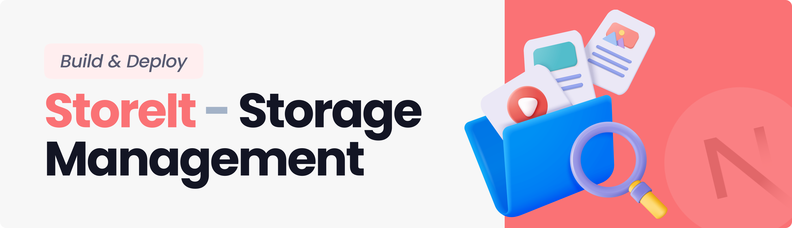

<div align="center">
  <br />
    
  <br />

  <div>
     
    
    
    
  </div>

<h1 align="center"><b>Storage and File Sharing Platform</b></h1>
</div>

## **Introduction**

A storage management and file sharing platform that lets users effortlessly upload, organize, and share files. Built with the latest Next.js 16, React 19 and the Appwrite Node SDK, utilizing advanced features for seamless file management.

## **Tech Stack**

- React 19
- Next.js 16
- Appwrite
- TailwindCSS V4
- ShadCN
- TypeScript

## **Features**

**User Authentication with Appwrite**: Implement signup, login, and logout functionality using Appwrite's authentication system.

**FIle Uploads**: Effortlessly upload a variety of file types, including documents, images, videos, and audio, ensuring all your important data.

**View and Manage Files**: Users can browse through their uploaded files stored in Appwrite storage, view on a new tab, rename file or delete.

**Download Files**: Users can download their uploaded files giving them instant access to essential documents.

**File Sharing**: Users can easily share their uploaded files with others, enabling collaboration and easy access to important content.

**Dashboard**: Gain insights at a glance with a dynamic dashboard that showcases total and consumed storage, recent uploads, and a summary of files grouped by type.

**Global Search**: Users can quickly find files and shared content across the platform with a robust global search feature.

**Sorting Options**: Organize files efficiently by sorting them by date, name, or size, making file management a breeze.

**Modern Responsive Design**: A fresh and minimalist UI that emphasizes usability, ensuring a clean aesthetic across all devices.

and many more, including the latest **React 19**, **Next.js 16** and **Appwrite** features alongside code architecture and
reusability

## **Quick Start**

Follow these steps to set up the project locally on your machine.

**Prerequisites**

Make sure you have the following installed on your machine:

- [Git](https://git-scm.com/)
- [Node.js](https://nodejs.org/en)
- [npm](https://www.npmjs.com/) (Node Package Manager)

**Clone the Repository**

```bash
git clone https://github.com/shekharsikku/store-it-drive

cd store-it-drive
```

**Install Dependencies**

Install the project dependencies using npm:

```bash
npm install
```

**Environment Variables Setup**

Create a new file named `.env.local` in the root of your project and add the following content:

```env
NEXT_PUBLIC_APPWRITE_ENDPOINT="https://cloud.appwrite.io/v1"
NEXT_PUBLIC_APPWRITE_PROJECT=""
NEXT_PUBLIC_APPWRITE_DATABASE=""
NEXT_PUBLIC_APPWRITE_USERS_COLLECTION=""
NEXT_PUBLIC_APPWRITE_FILES_COLLECTION=""
NEXT_PUBLIC_APPWRITE_BUCKET=""
NEXT_APPWRITE_SECRET_KEY=""
```

**Start Development**

```bash
npm run dev
```

**Build App**

```bash
npm run build
```

**Start App**

```bash
npm run start
```

Open [http://localhost:3000](http://localhost:3000) in your browser to view the project.

```bash
http://localhost:3000
```

#### MIT License | Developed by [Shekhar Sharma](https://linkedin.com/in/shekharsikku)

---
